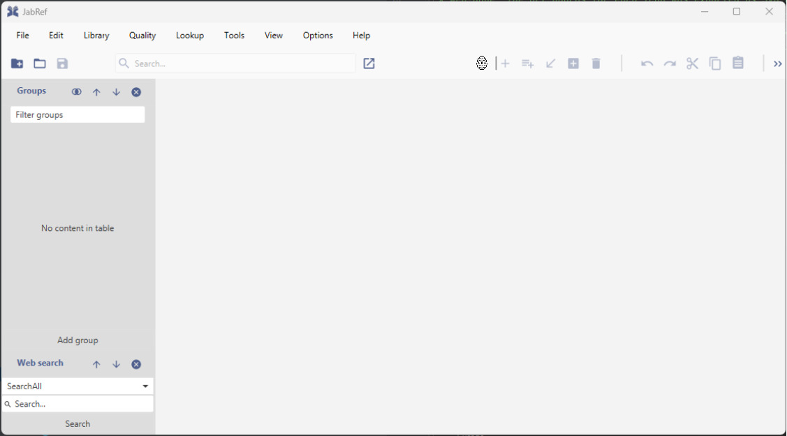

# Pflichtenheft
#####  (Nach Lichter & Ludwig, Software Engineering: Grundlagen, Menschen, Prozesse, Techniken)

| Version | Projektname   | Autor                        | Status | Datum        | Kommentar |
| ------- |---------------|------------------------------| ------ |--------------| --------- |
|  0.1    | EasterEggHunt | _____ _____, ________ _____, _____ _____, Emanuele Tirendi | zur Veröffentlichung freigegeben | 26.10.2023   | Von Emanuele Tirendi nachbearbeitete Version. |

## 1. Einleitung
### 1.0 Unsere Vision 
Unsere Vision ist es, den Menschen Freude am Lernen, Kennenlernen und Benutzen von Software zu vermitteln.

### 1.1 Zweck
Dieses Pflichtenheft legt die Funktionen fest, welche die JabRef-Erweiterung "Easter Egg Hunt" beinhalten wird.

### 1.2 Einsatzbereich und Ziele
Das Literaturverwaltungsprogramm Jabref besteht aus einer Vielzahl Funktionen und Bereichen. Die Applikation soll um einen "Easter Egg Hunt" erweitert werden. Neu werden an verschiedenen Orten der Applikation sogenannte Easter Eggs (siehe Definition unter 1.3) versteckt, mit denen Achievements (siehe Definition unter 1.3) erreicht werden können. Werden diese Easter Eggs gefunden und die entsprechenden Achievements erreicht, erhält der Benutzer eine Belohnung in Form eines Memes. Mit dem Erreichen aller Eastereggs schaltet der Benutzer die Funktion frei, seine Applikation in einer der 6 Regenbogenfarben darstellen zu können. Eine Übersichtsseite gibt einen Überblick darüber, welche Achievements erreicht und welche Memes gefunden worden sind.

Wir wollen JabRef so modifizieren, dass die Benutzer auf spielerische Weise dazu ermutigt werden, JabRef kennenzulernen und weiterzuverwenden. Die Erweiterung richtet sich sowohl and Erstnutzer von Jabref als auch an erfahrene Benutzer. Mithilfe des "Easter Egg Hunts" sollen auch Bereiche der Applikation kennengelernt werden, welchen normalerweise wenig Beachtung geschenkt wird.

Die Modifikation soll nicht als Tutorial dienen. 

### 1.3 Definitionen

| Begriff     | Definition                                                                                                                                                                                                                                                                                                    |
|-------------|---------------------------------------------------------------------------------------------------------------------------------------------------------------------------------------------------------------------------------------------------------------------------------------------------------------|
| Easteregg   | Ein Easteregg beschreibt z.B. ein Objekt (z.B. Button, Listeneintrag, ...) oder eine Aktion (z.B. Tastenkombination, Einfügen einer Entry in einer Library), welches gefunden oder ausgeführt werden muss und mit dem ein Achievement erreicht werden kann.    Unter 3.1.1 werden die Eastereggs spezifiziert. |
| Achievement | Ein Achievement ist z.B: das Klicken auf einem Easteregg bzw. das Lösen einer damit verbundenen Aufgabe. Das Erreichen eines Achievement führt zu einer Belohnung (das Freischalten eines Meme). Unter 3.1.1 werden alle Achievements definiert. Im Allgemeinen ist die Trennung von Eastereggs und Achievements nicht klar und im Zweifelsfall muss auf die genaue Definition in 3.1.1 eingegangen werden.                                                              |
| Feld        | Ein Feld ist eine rechteckige Fläche auf einem Fenster des GUIS, welche umrahmt ist.                                                                                                                                                                                                                         |
| Popup       | Ein Kleines Fenster, das erscheint und weggeklickt werden kann.                                                                                                                                                                                                                                                                           |
| Button      | Ein grafisches Steuerelement, das ein Ereignis auslöst, wenn der Nutzer drauf klickt.                                                                                                                                                                                                                         |
| GUI         | Graphical User Interface. Benutzeroberfläche                                                                                                                                                                                                                                                                  |
| Meme        | Ein ein lustiges Bild.                                                                                                                                                                                                                                                                               |

### 1.4 Referenzierte Dokumente

- Link zur Dokumentation von JabRef: https://docs.jabref.org/

### 1.5 Überblick

Die Punkte 2.1 und 2.5 stellen weitere Hintergrundinformationen und technische Details bereit.

Die Punkte 2.2 und 3. spezifizieren sowohl funktionale als auch nicht-funktionale Anforderungen.

Punkt 4 definiert die Abnahmekriterien.

### 1.6 Muss- und Kann-Vorschrift

In den Punkten 2 und 3 wird angeben, dass diese JabRef-Modifikation eine Anforderung haben muss, wenn diese Anforderung verbindlich ist, und es wird angegeben, dass diese Modifikaiton eine Anforderung haben kann, wenn sie nicht verbindlich ist und sie erst implementiert wird, wenn dies die zeitlichen Ressourcen zulassen.

## 2. Allgemeine Beschreibung

### 2.1 Einbettung

Die in 1.2 genannten Änderungen werden neben der bereits existierenden Funktionalität von JabRef bestehen. Entsprechend kann JabRef weiterhin vollumfänglich genutzt werden.

#### 2.1.1 Übersichtsseite Achievements 
Die Übersichtsseite wird über ein Icon in Form eines Ostereis zu erreichen sein. Dieses Icon wird links in der Toolbar platziert und mit einem Trennstrich abgegrenzt. Es verhält sich bei Vergrösserung und Verkleinerung des Fensters analog zu den anderen Icons in der Toolbar.

#### 2.1.2 Schnittstellen Easter Eggs: 
Die genaue Einbettung der Easter Eggs in die Applikation wird unter 3.1.1 beschrieben. 

### 2.2 Funktionen

2.2.1 Das System muss die vier Eastereggs bzw. dazugehörige Achievements beinhalten, welche unter 3.1.1.1 - 3.1.1.4 beschrieben sind. Das System kann vier weitere Eastereggs beinhalten (3.1.1.5 - 3.1.1.8). Wenn ein Achievement erreicht wird, muss ein Popup auftauchen, welches mit einem Klick auf einem Button geschlossen werden kann. Auf diesem Popup muss ein Meme sein.

2.2.2 Das System muss eine Übersichtsseite anbieten, bestehend aus so vielen Feldern, wie es Achievements gibt. Die Übersichtsseite muss für jedes Achievement auch einen Hinweis anbieten, wie das Achievement zu erreichen ist. Wenn die Übersichtsseite nach dem Erreichen eines Achievements geöffnet wird, muss das Meme auch angezeigt werden. Nachdem alle Achievements erreicht werden, muss aus der Übersichtsseite eine Meldung angezeigt werden, dass man die Achievements erreicht hat sowie der Pfad zu den Einstellungen, in denen man die Farbe der GUI ändern kann.

2.2.3 Wenn man nach dem Erreichen aller Achievements zu den Einstellungen (Options - Preferences - Appearance) navigiert, die es dem Benutzer erlauben, die Farbe des GUIs zu ändern, muss dort, zusätzlich zu den bisher möglichen Modi "Light" und "Dark", auch pink als Farbmodus angeboten werden. Das System kann die weiteren Farben rot, orange, gelb, grün und blau als Farbmodi anbieten.

### 2.3 Benutzerprofile

2.3.1 Wir empfehlen JabRef mit den hier beschriebenen Modifikationen sowohl für neue als auch erfahrenere Benutzer. Es wird nur vorausgesetzt, dass sie das Konzept einer Verwaltungssoftware für Referenzen verstanden haben, damit sie Eastereggs von normalen Funktionalitäten unterscheiden können.

2.3.2 Benutzer von JabRef mit der hier genannten Modifikationen müssen der deutschen Sprache mächtig sein. 

### 2.4 Einschränkungen, Annahmen und Abhängigkeiten

2.4.1 Die JabRef-Version, welche hier modifiziert wird, ist 5.9.

2.4.2 Die Entwicklung der Modifikation findet mit der Java-Version 19 statt.

2.4.3 Die vorliegende Modifikation soll keine zusätzlichen Anforderungen an die Hardwarespezifikation erzeugen.

2.4.4 Für Achievement 3.1.1.3 wird eine Internetverbindung benötigt.

## 3. Einzelanforderungen

### 3.1 Funktionale Anforderungen

3.1.1 Wir kennen folgende Achievements und Easteregg. Die Anforderungen 3.1.1.1 - 3.1.1.4 müssen und die Anforderungen 3.1.1.5 - 3.1.1.8 können implementiert werden.
* 3.1.1.1 Easteregg-Achievement-Paar
    * Titel: Teile mit uns, was du hast.
    * Easteregg: Button
    * Pfad zum Button: Main-page
    * Name des Buttons: *Bruder, gönn etwas.*
    * Aussehen des Buttons: Material-Desing-icon, F0C4F.
    * Lage des Buttons: Neben *Öffnet JabRefs GitHub-Seite*.
    * Achievement: Das erste mal auf den Button drücken.
    * Hinweis: Es ist ein Icon.
* 3.1.1.2 Easteregg-Achievement-Paar
    * Titel: Der Schlüssel führt zum Erfolg.
    * Easteregg: Button
    * Pfad zum Button: *Optionen -> Einstellungen -> Zitationsschlüsselgenerator*
    * Name des Buttons: Schlüssel zum Erfolg
    * Aussehen des Buttons: Genau wie der Button obendran.
    * Lage des Buttons: Unter *Keys vor dem Speichern erstellen (für Einträge ohne Key)*.
    * Achievement: Das erste mal auf den Button drücken.
    * Hinweis: Du musst den Schlüssel verändern können.
* 3.1.1.3 Easteregg-Achievement-Paar
    * Titel: XCQ der Link bleibt zu
    * Easteregg: Button
    * Pfad zum Button: *Optionen -> Einstellungen -> Benutzerdefinierte Exportformate*
    * Name des Buttons: kein Name, es ist unsichtbar
    * Aussehen des Buttons: unsichtbar
    * Lage des Buttons: Rechts neben *Hinzufügen*.
    * Weiteres: Ein button, der genauso aussieht wie *Hinzufügen*, aber mit *Link* beschrieben ist, der, wenn man auf ihn klickt, den User auf das Musikvideo von Rick Astley “Never gonna give you up” führt, befindet sich rechts neben dem Button.
    * Achievement: Das erste mal auf den Button drücken.
    * Hinweis: Finde die Lücke in den Einstellungen.
* 3.1.1.4 Easteregg-Achievement-Paar
    * Titel: Avada Kedavra
    * Easteregg: Die Handlung, die im Achievement beschrieben ist.
    * Achievement: Der Benutzer muss sich in einer Library befinden. Er muss auf *+ (Neuer Artikel)" drücken und in das Feld, wo man den Titel eingibt, *The boy who lived, come to die.* eingeben.
    * Hinweis: 1. Gehe auf eine Library. 2. Erstelle einen neuen Eintrag 3. Schreibe das passende Filmzitat in die Titel-Zeile des Eintrags. Hinweis: das Zitat stammt aus dem letzten Film der Harry Potter Reihe, kurz bevor der Hauptcharakter stirbt.
* 3.1.1.5 Easteregg-Achievement-Paar
    * Titel: Tickets for Movie
    * Easteregg: Die Handlung, die im Achievement beschrieben ist.
    * Achievement: Der Benutzer befindet sich auf der Main-Page. Er drückt in folgender Reihenfolge folgende Tasten: *Pfeiltaste hoch, Pfeiltaste hoch, Pfeiltaste runter, Pfeiltaste runter, Pfeiltaste links, Pfeiltaste rechts, Pfeiltaste links, Pfeiltaste rechts, Taste «B» (ohne Shift), Taste «A» (ohne Shift).
    * Hinweis: hoch - hoch - runter - runter - links - rechts - links - rechts - bravo - alpha
* 3.1.1.6 Easteregg-Achievement-Paar
    * Titel: Welcome to Hogwarts
    * Easteregg: Die Handlung, die im Achievement beschrieben ist.
    * Achievement: Der Benutzer hat mindestens eine Library mit 13 Einträgen.
    * Hinweis: Wie wäre es mit einer Unglück bringenden Library?
* 3.1.1.7 Easteregg-Achievement-Paar: 
    * Titel: Suche in der Vergangenheit
    * Easteregg: Log-Eintrag
    * Pfad zum Log-Eintrag: *Help -> View Event Log*
    * Name des Log-Eintrags: *Hid the easter egg in a place unknown to most.*
    * Aussehen des Log-Eintrags: wie alle anderen.
    * Lage des Log-Eintrags: Unterster Log-Eintrag.
    * Achievement: Das erste mal auf den Log-Eintrag drücken.
    * Hinweis: Vergangene Events sind noch heute spannend.
* 3.1.1.8 Easteregg-Achievement-Paar:
    * Titel: Find the hidden message
    * Easteregg: Link und HTML-Seite, die sich beim Klicken auf den Link öffnet
    * Pfad zum Link: *Help -> Jabref resources*
    * Name des Links: Zotero
    * Aussehen des Links: Zotero icon, wobei rechts davon der Name steht
    * Lage des Links: Unter GitHub
    * Achievement: Die Aufgabe, die auf der HTML-Seite beschrieben ist, lösen.
    * Aufgabe: Auf der HTML-Seite wird beschrieben, dass eine geheime Nachricht gefunden werden muss. Diese kann im HTML-Code der Seite gefunden werden. Bei der geheimen Nachricht handelt es sich um einen Artikel (Link oder anderer eindeutiger Identifier für den Artikel http://www.inthelibrarywiththeleadpipe.org/2013/giving-games-the-old-college-try/). Wenn dieser Artikel zur Library hinzugefügt wird, gilt das Achievement als bestanden.   
    * Hinweis: be resourceful
  
3.1.2 Immer wenn ein Achievement erreicht worden ist, muss ein Popup mit dem zum Achievement gehörigen Meme auftauchen. Dieser Popup enthält eine Schliess-Taste, mit der man das Popup schliessen kann.

3.1.3 Auf der Main-page links neben dem *+ (Neuer Artikel)* muss es ein Trennzeichen und links davon ein Button mit einem Osterei geben. Wenn man mit der Maus über diesen Button geht, muss ein kleines Feld mit der Aufschrift *Übersichtsseite* auftauchen. Wenn man auf diesem Button klickt, muss sich ein Fenster mit der Übersichtsseite öffnen.

3.1.3.1 Wenn die Übersichtsseite geöffnet ist, muss der Rest von JabRef nicht bedient werden können.

3.1.3.2 Die Übersichtsseite muss eine Schliesstaste haben, mit der man die Übersichtsseite schliessen kann.

3.1.3.3 Der Inhalt der Übersichtsseite muss aus genau soviel Felder wie Achievements bestehen. Jedes Feld entspricht einem Easteregg-Achievement-Paar. Jedes dieser Felder hat den in 3.1.1 beschriebenen, zum Easteregg-Achievement-Paar zugehörigen Titel und innerhalb von jedem dieser Felder ist oben links ein kleiner Button mit einem Fragezeichen. Wenn man auf dieses Fragezeichen klickt, kmmt ein Popup mit einer *ok*-Taste, mit der man das Popup schliessen kann. Auf dem Popup ist dann zu jedem Easteregg-Achievement-Paar den in 3.1.1 beschrienen Hinweis zu finden.

3.1.3.4 Für jedes Easteregg-Achievement-Paar, für welches das Achievement noch nicht erreicht wurde, muss der Rest des Felds leer sein.

3.1.3.5 Für jedes Easteregg-Achievement-Paar, für welches das Achievement erreicht wurde, muss das Feld mit dem dazugehörigen Meme ausgefüllt sein.

3.1.3.6 Wenn alle Achievements erreicht worden sind, muss auf der Übersichtsseite oberhalb der Felder eine Nachricht auftauchen, in welcher drauf steht: "Herzlichen Glückwunsch! Du hast alle Achievements erreicht. Du kannst nun zu den Farbeinstellungen gehen und deine Lieblingsfarbe wählen. Gehe dafür zu *Optionen -> Einstellungen -> Erscheinungsbild* und wähle deine Lieblingsfarbe aus."

3.1.3.6 Wenn alle Achievements erreicht worden sind, muss die Belohnung freigeschaltet werden, was Folgendes bedeutet: Es befinden sich unter *Optionen -> Einstellungen -> Erscheinungsbild* unterhalb der Buttons *Helles Theme* und *Dunkles Theme* auch das Button *Pinkes Theme*. Zusätzlich können auch die Buttons **Oranges Theme*, *Gelbes Theme*, *Grünes Theme*, *Blaues Theme* und *Rotes Theme* stehen. Wenn man auf eines dieser Buttons klickt, muss sich die Farbe des GUIs in die entsprechende Farbe im gleichem Masse ändern, wie sie sich in schwarz oder weiss verändert bei den bereits bestehenden Buttons.

## 4. Abnahmekriterien

4.1 Die Abnahmekriterien für eine JabRef Distribution, die unsere Modifikation enthält und die noch nicht geöffnet worden ist, sind:
* 4.1.1 Für die in 3.1.1.1 - 3.1.1.4 angegebenen Easteregg-Achievement-Paaren muss:
    * 4.1.1.1 bevor man das entsprechende Achievement erreicht, in der Übersichtsseite das entsprechende Feld kein Meme enthalten.
    * 4.1.1.2 bevor und nachdem man das entsprechende Achievement erreicht, in der Übersichtsseite, wenn man das Fragezeichen auf das entsprechende Feld klickt, ein Popup mit einem Hinweis kommen.
    * 4.1.1.3 wenn man das entsprechende Achievement erreicht, ein Popup mit dem entsprechenden Meme auftauchen.
    * 4.1.1.4 nachdem man das entsprechende Achievement erreicht, in der Übersichtsseite das entsprechende Feld das entsprechende Meme enthalten.
* 4.1.2 und für die Einstellungen für die Farbauswahl des GUIS muss:
    * 4.1.2.1 bevor man alle Achievements erreicht hat, nicht die Möglichkeit bestehen, die Farbe des GUIS in pink zu ändern.
    * 4.1.2.2 nachdem man alle Achievements erreicht hat, die Möglichkeit bestehen, die Farbe der GUIs in pink zu ändern.
* 4.1.3 und für die Übersichtsseite muss:
    * 4.1.3.1 bevor man alle Achievements erreicht hat, kein Text oberhalb der Felder für die Achievements stehen.
    * 4.1.3.2 nachdem man alle Achievements erreicht hat, ein Text oberhalb der Felder für die Achievements stehe, nämlich: "Herzlichen Glückwunsch! Du hast alle Achievements erreicht. Du kannst nun zu den Farbeinstellungen gehen und deine Lieblingsfarbe wählen. Gehe dafür zu *Optionen -> Einstellungen -> Erscheinungsbild* und wähle deine Lieblingsfarbe aus.".

# Anhang

## Anhang Use-cases

### Use case 1

#### Use case 1.1

* Name: Öffnen der Übersichtsseite
* Akteure: User
* Vorbedingung: JabRef ist geöffnet. User befindet sich auf der Main-Page.
* Nachbedingung (Erfolg): Ein neues Fenster öffnet sich mit der Übersichtsseite. Die restliche JabRef-GUI kann nicht verwendet werden.
* Nachbedingung (Fehler): Kein sinnvoller Fehler definierbar.
* Standardablauf: User klickt auf dem Osterei-Icon, welches sich links vom Trennzeichen befindet, welches sich ebenfalls links vom “+”-Zeichen befindet, welcher benutzt werden kann, um einen neuen Artikel zu machen.

#### Use case 1.2

* Name: Übersichtsseite, Hint anfordern 
* Akteure: User 
* Vorbedingung: Nachbedingung (Erfolg) des use case 1. 
* Nachbedingung (Erfolg): Ein Popup-Fenster mit einem Hint taucht auf mit einem “ok”-Button. 
* Nachbedingung (Fehler): Kein sinnvoller Fehler definierbar.
* Standardablauf: Jedes Achievement hat ein Feld mit einem Fragezeichen auf der Übersichtsseite. Der User klickt auf das Fragezeichen, welches sich oben links in einem der Felder befindet.

### Use case 2

* Name: Achievement erreichen 
* Akteure: User 
* Vorbedingung: siehe Vorbedingungen 2.1 – 2.4, die nachfolgend beschrieben werden. Zusätzlich ist ebenfalls Bedingung, dass das jeweilige Achievement noch nicht erreicht ist (ansonsten passiert nichts).
* Nachbedingung (Erfolg): Ein Fenster öffnet sich. Darin wird das freigeschaltene Meme angezeigt. Auf der Übersichtsseite ist das Meme nun ebenfalls dauerhaft sichtbar.
* Nachbedingung (Fehler): keine sinnvollen Fehler definiertbar
* Standardablauf:
    * Schritt 1: Der User führt die in *Achievements erreichen 2.1 - 2.4* beschriebenen Schritte durch.

Vorbedingungen 2.1 – 2.4 
* 2.1 Vorbedingung für 3.1.1.1: JabRef ist auf dem Computer geöffnet und der User muss auf der Main-page sein.
* 2.2 Vorbedingung für 3.1.1.2: JabRef ist auf dem Computer geöffnet und der User muss sich unter Optionen -> Einstellungen -> Zitationsschlüsselgenerator befinden.
* 2.3 Vorbedingung für 3.1.1.3: JabRef ist auf dem Computer geöffnet und der User muss in den Einstellungen unter dem Punkt “Benutzerdefinierte Exportformate” sein.
* 2.4 Vorbedingung für 3.1.1.4: JabRef ist auf dem Computer geöffnet und der User hat eine Library erstellt, damit er einen Eintrag manuell einfügen kann. User befindet sich im Zustand, dass er einen Eintrag manuell einfügen kann.

Achievement erreichen 2.1 - 2.4
* 2.1 Achievement erreichen für 3.1.1.1: Auf dem Button mit Material-Design-Icon F0C4F (Charity), der sich neben dem GitHub-Button befindet, klicken.
* 2.2 Achievement erreichen für 3.1.1.2: Auf dem Button, auf dem "Schlüssel zum Erfolg" steht, klicken.
* 2.3 Achievement erreichen für 3.1.1.3: Auf dem unsichtbarer Button, der zwischen dem “Add”- und dem "Link"- Button versteckt ist, klicken.
* 2.4 Achievement erreichen für 3.1.1.4: Der User tippt das Zitat: “The boy who lived has come to die” in die Spalte für den Titel ein.

### Use case 3

* Name: Farbe der GUI 
* Akteure: User 
* Vorbedingung: JabRef ist geöffnet. User befindet sich auf *Optionen -> Einstellungen -> Erscheinungsbild*. Alle Achievements sind erreicht. 
* Nachbedingung (Erfolg): Das GUI hat edie Farbe, auf die geklickt worden ist.
* Nachbedingung (Fehler): Kein sinnvoller Fehler definierbar. 
* Standardablauf: User klickt auf einem der Buttons *Rotes Theme*, *Oranges Theme*, *Gelbes Theme*, *Grünes Theme*, *Blaues Theme* und *Lila Theme*.

## Anhang Memes

Meme zu 3.1.1.1:

Meme zu 3.1.1.2:

Meme zu 3.1.1.3:

Meme zu 3.1.1.4:

Meme zu 3.1.1.5:

Meme zu 3.1.1.6:

Meme zu 3.1.1.7:

Meme zu 3.1.1.8:

