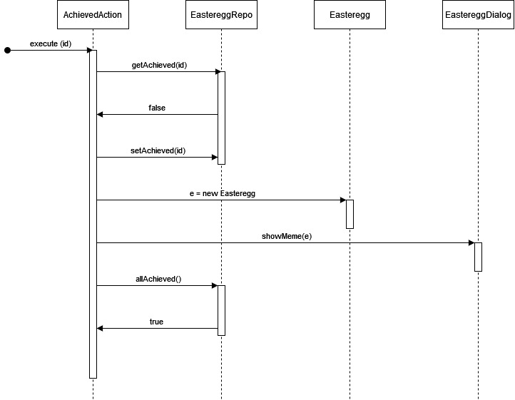
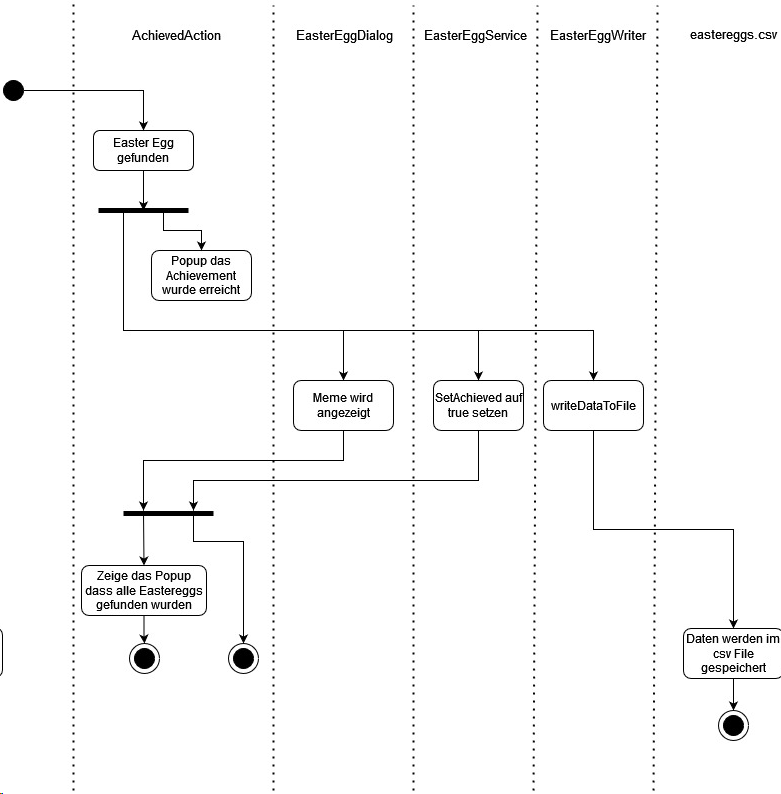
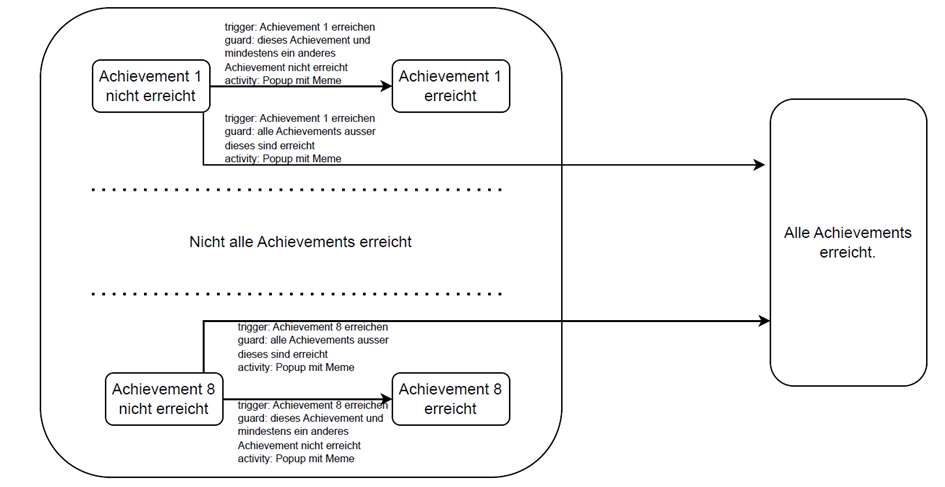

# Technische Dokumentation

| Version | Projektname   | Autor                        | Status | Datum        | Kommentar |
| ------- |---------------|------------------------------| ------ |--------------| --------- |
|  0.1    | EasterEggHunt | _____ _____, ________ _____, _____ _____, Emanuele Tirendi | zur Veröffentlichung freigegeben | 08.11.2023   | Von Emanuele Tirendi nachbearbeitete Version. |


# 1 Einführung

# 1.1 Zweck

<!--- Beschreiben sie was das Ziel und der Zweck dieses Dokuments ist. An wen richtet es sich und was soll kommuniziert werden? --->

Diese Dokumentation beschreibt das Design vom EasterEggHunt, einer Erweiterung von JabRef. Das Dokument soll für zukünftige Veränderungen bzw. Weiterentwicklungen der Software dem Entwickler einen Überblick geben.

# 1.2 Beziehung zu anderen Dokumenten

<!--- Geben sie hier andere relevante Dokumente an, wie z.B. das Pflichtenheft --->

Es besteht ein Pflichtenheft (EasterEggHunt_Pflichtenheft.md), worin u.a. die Funktionen beschrieben werden, die vom System geleistet werden..

Der Übersicht halber werden hier nochmal die Definitionen der Begriffe gegeben.

| Begriff     | Definition                                                                                                                                                                                                                                                                                                    |
|-------------|---------------------------------------------------------------------------------------------------------------------------------------------------------------------------------------------------------------------------------------------------------------------------------------------------------------|
| Easteregg   | Ein Easteregg beschreibt z.B. ein Objekt (z.B. Button, Listeneintrag, ...) oder eine Aktion (z.B. Tastenkombination, Einfügen einer Entry in einer Library), welches gefunden oder ausgeführt werden muss und mit dem ein Achievement erreicht werden kann.  <br/> Unter 3.1.1 werden die Eastereggs spezifiziert. |
| Achievement | Ein Achievement ist z.B: das Klicken auf einem Easteregg bzw. das Lösen einer damit verbundenen Aufgabe. Das Erreichen eines Achievement führt zu einer Belohnung (das Freischalten eines Meme). Unter 3.1.1 werden alle Achievements definiert. Im Allgemeinen ist die Trennung von Eastereggs und Achievements nicht klar und im Zweifelsfall muss auf die genaue Definition in 3.1.1 eingegangen werden.                                                              |
| Feld        | Ein Feld ist eine rechteckige Fläche auf einem Fenster des GUIS, welche umrahmt ist.                                                                                                                                                                                                                         |
| Popup       | Ein Kleines Fenster, das erscheint und weggeklickt werden kann.                                                                                                                                                                                                                                                                           |
| Button      | Ein grafisches Steuerelement, das ein Ereignis auslöst, wenn der Nutzer drauf klickt.                                                                                                                                                                                                                         |
| GUI         | Graphical User Interface. Benutzeroberfläche                                                                                                                                                                                                                                                                  |
| Meme        | Ein ein lustiges Bild.                                                                                                                                                                                                                                                                               |

# 2. Systemübersicht


Das Literaturverwaltungsprogramm Jabref besteht aus einer Vielzahl von Funktionen und Bereichen. Die Applikation soll um einen "Easter Egg Hunt" erweitert werden. Neu werden an verschiedenen Orten der Applikation sogenannte "Easter Eggs" versteckt, mit denen Achievements erreicht werden können. Werden diese "Easter Eggs" gefunden und die entsprechenden Achievements erreicht, erhält der Benutzer eine Belohnung in Form eines Memes. Mit dem Erreichen aller Eastereggs schaltet der Benutzer die Funktion frei, seine Applikation in einem neuen Farbmodus darstellen zu lassen.

Wir wollen JabRef so modifizieren, dass die Benutzer auf spielerische Weise dazu ermutigt werden, JabRef kennenzulernen und weiterzuverwenden. Die Erweiterung richtet sich sowohl and Erstnutzer von Jabref als auch an erfahrene Benutzer. Mithilfe des "Easter Egg Hunts" sollen auch Bereiche der Applikation kennengelernt werden, welchen normalerweise wenig Beachtung geschenkt wird.

# 3. Designziele

<!--- Es gibt kein absolutes Mass für gutes oder schlechtes Design. Das Design
ist nur gut oder schlecht bezüglich den Anforderungen der Stakeholder.
Hier sollten die Ziele/Anforderungen kurz beschrieben werden. Beispiele sind:
* Das Design soll künftige Erweiterbarkeit gewährleisten
* Das Design soll zu minimalen Entwicklungszeit/Kosten führen
* Das Design soll maximale Performance gewährleisten
* ... --->

Bei unserem Design haben wir vor allem auf folgende Aspekte geachtet:
* **Das Hinzufügen neuer Eastereggs soll so trivial wie möglich sein.** Es liegt in der Natur von Eastereggs, dass sie vielfältig sind und in ganz unterschiedlichen Bereichen der Applikation versteckt werden, damit sie schwer zu finden und die Achievements schwer zu erreichen sind. Entsprechend ist das Hinzufügen eines neuen Eastereggs nie trivial. Man kann aber versuchen, die Einbettung eines neuen Eastereggs in die bereits bestehende und funktionierende Easteregg-Hunt-Infrastruktur so einfach wie möglich zu gestalten.
* **Minimale Entwicklungszeit.** Direkt auf dem gerade genannten Punkt aufbauend, kann die Modifikation, wenn einmal die Infrastruktur für die Eastereggs steht, ganz einfach auf die Teammitglieder*innen aufgeteilt werden, da die Interfaces, mit welchen die Eastereggs mit der Infrastruktur kommunizieren, eindeutig und einfach definiert sind.
* **Design for change by separation of responsibilities.** Einige Aufteilungen der Verantwortlichkeiten nsind für den Entwicklungsprozess und dem intuitiven Verständnis der Entwicklern nicht nötig gewesen. Nichtsdestotrotz sind sie implementiert worden. Künftige Ausarbeitungen und Erweiterungen der Easteregg-Infrastruktur würden eine Aufteilung dieser Verantwortlichkeiten nötig machen. Entsprechend kann diese Entscheidung als ein Beispiel des Designs for Change betrachtet werden. Beispielsweise ist die zentrale Instanz, die für Module wie die Übersichtsseite Informationen zu den Eastereggs und Achievements bereitstellt und diese Informationen über die Lebenszeit des Prorammes persistent speichert, in zwei Klassen aufgeteilt worden statt in nur einer, nämlich in die Klassen EasterEggRepository und EasterEggService. Diese werden im Klassendiagramm in 5.1 beschrieben.

# 4. Systemverhalten

<!--- Um die Designlösung, die nachfolgend beschrieben wird, einzuführen, sollten an dieser Stelle nochmals das gewünschte Verhalten des Systems (abgeleitet aus dem Pflichtenheft) kurz beschrieben werden.
Idealerweise sollte hier genügend Information gegeben werden, sodass man die Diagramme und Spezifikationen die im nächsten Abschnitt beschrieben werden verstehen kann, ohne zuvor das Pflichtenheft im Detail gelesen zu haben. --->

4.1 Das System muss die vier Eastereggs bzw. dazugehörigen Achievements beinhalten, welche im Pflichtenheft unter 3.1.1.1 - 3.1.1.4 beschrieben sind. Das System kann vier weitere Eastereggs beinhalten (im Pflichtenheft unter 3.1.1.5 - 3.1.1.8). Eastereggs können beispielsweise Buttons sein bzw. das Klicken auf einem Button. Wenn ein Achievement erreicht wird, taucht ein Popup mit einem Meme auf.

4.2 Das System muss eine Übersichtsseite anbieten, bestehend aus so vielen Feldern, wie es Achievements gibt. Das System muss für jedes Achievement auch einen Hinweis für jedes Achievement anbieten, wie zu erreichen ist. Wenn die Übersichtsseite nach dem Erreichen eines Achievements geöffnet wird, muss das System das Meme auch anzeigen. Nachdem alle Achievements erreicht worden sind, muss durch das System auf der Übersichtsseite eine Meldung angezeigt werden, dass man die Achievements erreicht hat sowie der Pfad zu den Einstellungen, in denen man die Farbe er GUI ändern kann, angezeigt werden.

4.3 Wenn man nach dem Erreichen aller Achievements zu den Einstellungen (Options - Preferences - Appearance) navigiert, die es dem Benutzer erlauben, die Farbe des GUIs zu ändern, muss das System dort, zusätzlich zu den bisher möglichen Modi "Light" und "Dark", auch pink als Farbmodus anbieten. Das System kann die weiteren Farben rot, orange, gelb, grün und blau als Farbmodi anbieten.

# 5. Design

<!--- An dieser Stelle wird nun das eigentliche Softwaredesign (die technische Lösung) beschrieben.
In grösseren Systemen wird typischerweise zwischen High-level Design (Architektur) sowie Mid-level Design (UML Klassen- und Sequenzdiagramme) sowie Detaildesign (Detaillierte Beschreibung von einigen Schlüsselklassen) unterschieden.
Für diese kleine Änderung, muss diese Unterscheidung aber nicht gemacht werden. Jedoch wollen wir explizit zwischen Statik, Dynamik und Logik zu unterscheiden. --->

Diese Software ist in Java geschrieben und erweitert Jabref, was also bedeutet, dass das Design unserer Modifikation dem gleichen Stil wie das bereits bestehende Design von JabRef folgt. In erster Linie bedeutet dies die Verwendung objektorientierten Designs.

## 5.1 Statik

<!--- An dieser Stelle sollten die statischen Aspekte, zum Beispiel mit Hilfe von UML Klassendiagrammen oder Paketdiagrammen beschrieben werden. --->
### Klassendiagramm 
Das gezeigte Klassendiagramm beschränkt sich auf die für die Erweiterung relevanten Klassen.

* **Easteregg-Metadaten: org.jabref.model.eastergg:** In diesem package ist die Klasse **Easteregg** gespeichert, welche alle Metadaten eines Eastereggs. Ein solches Eastergg ist eindeutig durch ein Wert der Enumeration **EastereggID** identifiziert.
* **Informationsverwaltung der Easteregg-Metadaten: org.jabref.logic.eastereggs:** Die Klasse **EasterEggService** ist die Schnittstelle, die andere Module verwenden, wenn sie Metadaten zu den EasterEggs brauchen. Diese Klasse wiederum verwendet **EasterEggRepository**, zum die persistente Speicherung der EasterEggDaten zu gewährleisten wie z.B. ein Flag, der angibt, ob ein zu einem EasterEgg gehöriges Achievement bereits erreicht worden ist oder nicht. Für die persistente Speicherung in einer Datei vom **csv**-Format werden **EasterEggWriter**, **EasterEggParser** und **EasterEggFormat** verwendet.
* **Übersichtsseite und Eventhandler: org.jabref.gui.achievements:** Die Methode **execute** der Klasse **AchievedAction** ist die Methode, die aufgerufen wird, wenn ein Achievement erreicht worden ist. Diese konstruiert eine Instanz von **EasterEggDialog** zum das dazugehörige Meme in einem Popup erscheinen zu lassen. Die Klasse **ShowAchievementOverviewAction** ist die Klasse verantwortlich für die Übersichtsseite während **AchievementOverviewDialog** verantwortlich für ein einzelnes Feld in der Übersichtsklasse ist.
* Daneben sind weitere Klassen eingezeichnet, die mit den genannten Klassen interagieren oder in denen die Farbmodi für die GUI implementiert worden sind.


## 5.2 Dynamik

<!--- An dieser Stelle sollten die dynamischen Aspekte, zum Beispiel mit Hilfe von UML Sequenz-, Aktivitäts- oder Zustandsdiagrammen spezifiziert werden. --->

### 5.2.1 Sequenz bei Erreichen des letzten Achievements

Die Sequenz beginnt mit der Auslösung der execute(id)-Funktion durch ein entdecktes Easteregg. Diese Funktion aktiviert die AchievedAction-Klasse. Als nächstes überprüft AchievedAction mit getAchieved(id), ob das spezifische Achievement bereits erreicht worden ist, indem es auf das EastereggRepo zugreift. Wenn das Achievement noch nicht erreicht worden ist, d.h. wenn false zurückgegeben wird, setzt AchievedAction das Easteregg auf den erreichten Status mit setAchieved(id).

Anschließend erstellt AchievedAction eine Instanz der Easteregg-Klasse. Der nächste Schritt in der Sequenz ist die Ausführung von showMeme(e), was zu einem Übergang zur EastereggDialog-Klasse führt.

Nachdem das Meme im Dialog angezeigt wurde, führt AchievedAction mit allAchieved() in EastereggRepo eine Überprüfung durch, ob alle Eastereggs gefunden wurden. Ist dies der Fall, wird true zurückgegeben.

Die zentralisierte Kontrolle über den Ablauf durch die Klasse AchievedAction macht die Sequenz einerseits leicht nachvollziehbar (siehe Diagramm unten). Andererseits hat AchievedAction ein grosser Fan-out und macht sie abhängig von vielen anderen Klassen. Im Sinne eines Black-Boards halten wir dies trotzdem für eine Struktur, die relativ leicht verändert werden kann.



### 5.2.2 Aktivitätsdiagramm


### 5.2.3 Zustände bzgl. erreichten Achievements

Das folgende Zustandsdiagramm soll beschreiben, in welche Zustände sich das System bzgl. den erreichten Achievements befinden kann. Entsprechend sind hier nicht Zustände von Objekten dargestellt, wie es sonst für Zustandsdiagramme üblich.

Wir unterscheiden hier grob zwei Zustände. Einerseits gibt es den Zustand, bei dem alle Achievements erreicht sind und den Zustand, bei dem nicht alle Zustände erreicht sind. Bei letzterem unterscheiden wir für jedes Achievement (hier exemplarisch acht Achievements) die Sub-Zustände, bei denen das spezifische Achievement erreicht ist oder nicht. Wir haben exemplarisch nur die Unterzustände für Achievement 1 und Achievement 8 dargestellt und haben die Achievements 2-7 ausgelassen.

Diese Zustände reflektieren sich auch im EasterEggRepository:
* Die Methode isAllAchieved() gibt genau dann true zurück, wenn sich EasterEggRepository im Zustand befindet, dass alle Eastereggs erreicht sind.
* Die Methode getAchieved(id) gibt genau dann true zurück, wenn sich EasterEggREpository nicht im Zustand befindet, dass das entsprechende Achievement nicht erreicht ist.



## 5.3 Logik

<!--- _An dieser Stelle können noch logische Aspekte, wie zum Beispiel logische Einschränkungen spezifiziert werden. Hierzu kann zum Beispiel OCL verwendet werden. --->

Hier werden noch die im Zustandsdiagramm von 5.2.3 beschriebenen Zustände im Kontext der Methode AchievedAction::execute(id) beschrieben.

Hier wird folgendes beschrieben: Wenn alle Achievements bis auf eines erreicht sind und **execute()** für dieses eine Achievement aufgerufen wird, dann gibt die Funktion **allAchieved()** den Wert **true** zurück.

```ocl
context AchievedAction::execute(EasterEggID id)
post: self.execute(id) and EasterEggID->allInstances(otherID | otherID <> id -> self.easterEggService.getAchieved(otherID)) -> self.easterEggService.allAchieved()
```